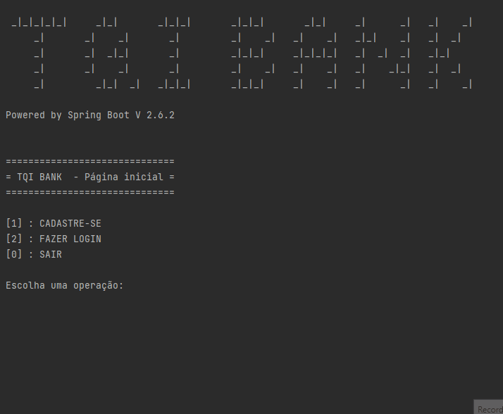

# Desafio *TQI Evolution* - TQI BANK

   

##Sobre o Sistema
O sistema roda em CLI, com menus interativos.

##MySQL com Docker Compose

Para persistência de dados, foi utilizado o banco de dados **MySQL**, em um container **Docker** iniciado por um arquivo *docker-compose.yml*. Essa abordagem foi escolhida pois já foi utilizada em alguns outros projetos do meu portefólio.

##Validação e Testes Unitários

Inicialmente, tentei usar o *Bean Validation*, mas ocorreram alguns problemas. Então decidi fazer um *validator* customizado, que checa os formulários, tanto de clientes como os dos empréstimos. Foram usando algumas expressões regulares para checagem de CPF e RG.
Nessa etapa, os testes unitários foram cruciais.

##Encriptação de senha (BCript)
A primeira versão do login tinha um método simples com checagem de strings, mas fiquei incomodado pelo fato da senha ficar aberta na tabela do banco de dados. Então o usei o encriptador *BCript*, da dependência *Spring Security*.  A senha passa por uma validação de números mínimos de caracteres, depois é encriptada e só então salva no DB. É realizado o caminho inverso para o login.

##Execução
Para executar o projeto:
´docker compose up´  para baixar as dependência e rodar o MySQL no Docker e depois dar play no projeto.

##Notas

A versão original desse projeto utilizava Kafka, na parte de Cadastro de clientes. Infelizmente, por problemas técnicos, não foi possível completar essa versão.

